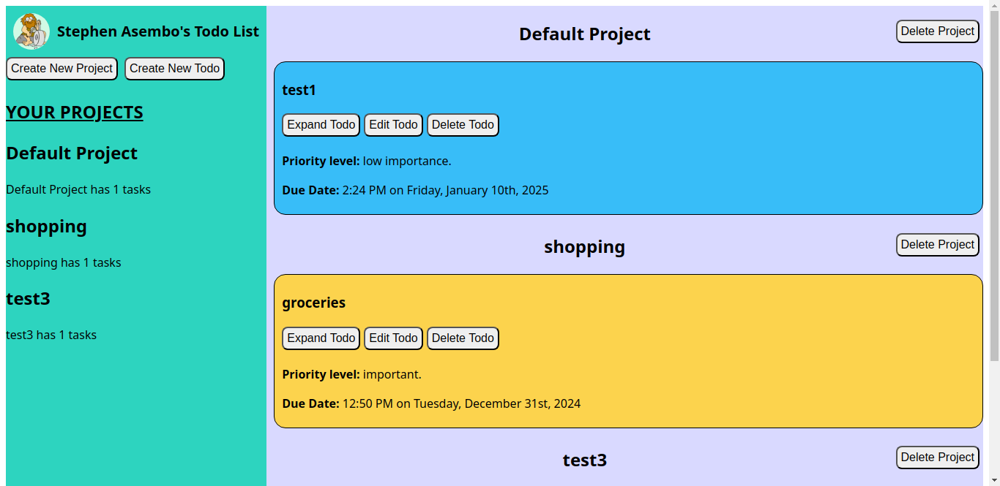
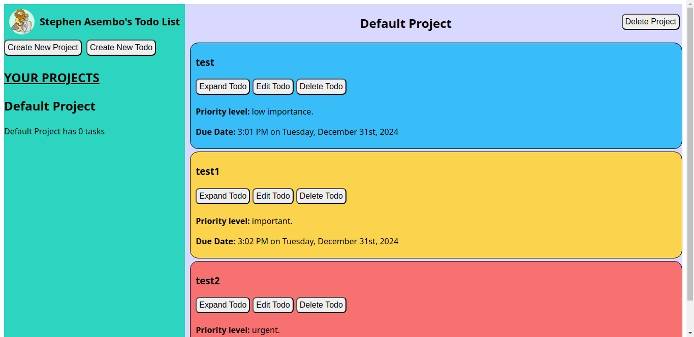
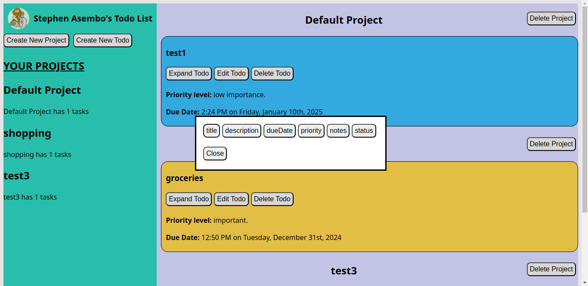
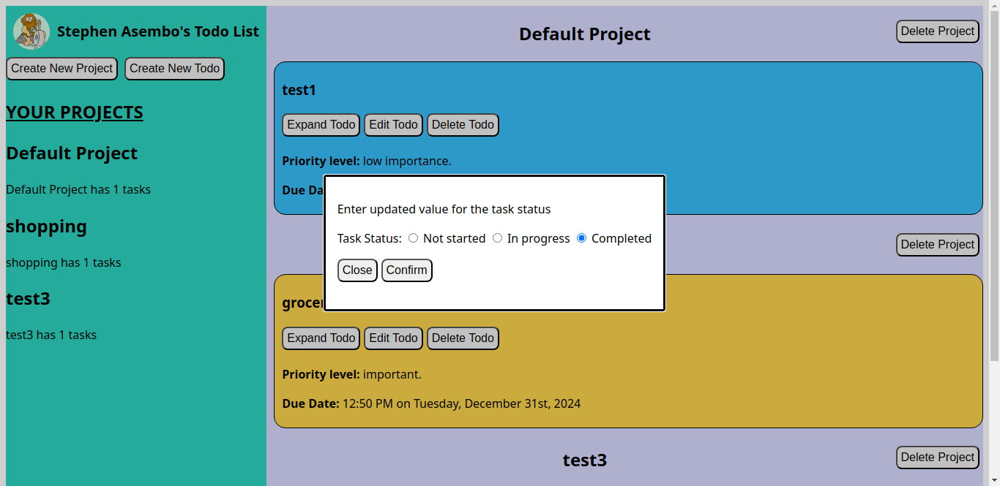
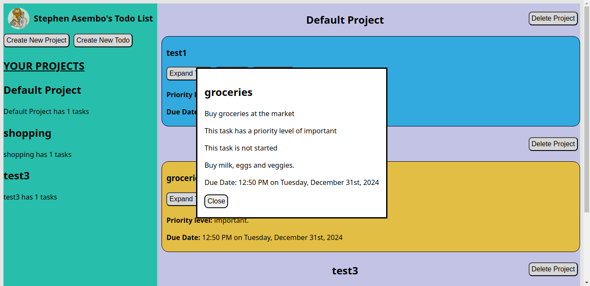

# Todo-list

## Table of Contents
- [Introduction](#introduction)
- [Features](#features)
- [File Structure](#file-structure)
- [Technologies Used](#technologies-used)
- [Installation](#installation)
- [Live Preview](#live-preview)
- [Screenshots](#screenshots)
- [Known Limitations](#known-limitations)
- [Future Improvements](#future-improvements)
- [Acknowledgments](#acknowledgments)

## Introduction
This Todo list application is a project built as part of my web development learning journey in The Odin Project curriculum. It enables users to organize their tasks and projects, offering features like task prioritization and project grouping. This app emphasizes modularization and adheres to good coding practices, ensuring maintainability and clarity.

## Features
1. Create and Manage Projects:
- Add new projects to group related tasks.
- Delete projects when no longer needed.

2. Todo Management:
- Add tasks with details like title, description, due date, and priority.
- Edit existing tasks to update information.
- Delete tasks when completed or no longer relevant.

3. Priority-Based Color Coding:
- Tasks are visually distinguished by priority:
    - Low Priority: Blue.
    - Important: Orange.
    - Urgent: Red.

4. Dynamic UI Updates:

- Real-time updates ensure that changes in tasks or projects are immediately reflected in the user interface.

5. Optimized Deployment:
- Built using Webpack, ensuring optimized performance in production mode.

## File Structure

```plaintext
src/
|-- assets
|   |-- images           // Profile photo
|-- scripts
|   |-- index.js        // Entry point
|   |-- storage.js      // Stores and retrieves user's created projects
|   |-- dom             // Select dom nodes and render display
|   |-- project         // Project management logic
|   |-- todo            // Todo management logic
|   |-- utils           // Utility functions
|-- styles             // Css files used for styling

```

## Technologies Used
- **HTML5 and CSS3:** for the structure and styling.
- **JavaScript:** for dynamic functionality.
- **Webpack:** for bundling and optimizing code.

## Installation
1. Clone the repository:
 ```bash
git clone https://github.com/Stephenasembo/Todo-list.git
   ```
2. Navigate to the project folder:
```bash
cd Todo-list
```
3. Install dependencies:
```bash
npm install
```
4. Start the development server:
```bash
npm run start
```
5. Open your browser and navigate to http://localhost:8080/.


## Live Preview
The project is live and can be accessed [here](https://stephenasembo.github.io/Todo-list/)

## How to Use
1. Create a new project:
    - Press 'Create New Project' button.
    - Enter the name for your new project.
    - To cancel project creation press the 'Cancel' button.
    - Press confirm.

2. Create a new todo:
    -Press 'Create New Todo' button.
    - Enter the details of your todo.
        - Title, due date, priority level and status are mandatory for a new todo.
    - To cancel todo creation press the 'Cancel' button.
    - Press the 'Confirm' button.

3. View todo details:
    - Press 'Expand Todo' button.
    - When done close the modal by pressing 'close' button.

4. Edit todo:
    - Press 'Edit Todo' button.
    - To cancel editing the todo press the 'Cancel' button.
    - Click on the desired entry for edit.
    - Enter the new value for the entry.
    - To cancel editing the todo entry press the 'Cancel' button.
    - Press the 'confirm' button to edit the todo.

5. Delete todo:
    - Press the 'Delete Todo' button.

6. Delete project:
    - Press the 'Delete Project' button next to the title of the project.

## Screenshots
### Homepage

*Homepage of user's todo-list with projects and related tasks*

### Task color coding

*Tasks colored according to priority level.*

### Task editing options

*Display of editable todo content.*

### Update task status

*Change task status after starting or completion of task.*

### Read todo details

*Todo details expanded.*

## Known Limitations
These topics will be covered later in the curriculum.

- **Responsiveness:** The app is not fully optimized for mobile devices.

- **Accessibility:** No specific ARIA attributes or accessibility enhancements have been implemented yet.

- **Animations:** Visual transitions and effects are minimal. 

## Future Improvements
- Add responsiveness to improve usability on different screen sizes.

- Enhance accessibility for a more inclusive user experience.

- Implement animations to improve visual appeal and interactivity.

## Acknowledgments
Caveman profile image by <a href="https://pixabay.com/users/openclipart-vectors-30363/?utm_source=link-attribution&utm_medium=referral&utm_campaign=image&utm_content=159359">OpenClipart-Vectors</a> from <a href="https://pixabay.com//?utm_source=link-attribution&utm_medium=referral&utm_campaign=image&utm_content=159359">Pixabay</a>

This project is part of The Odin Project curriculum, which has been instrumental in my web development journey.
---
Feel free to provide feedback or suggestions to help improve the app further!